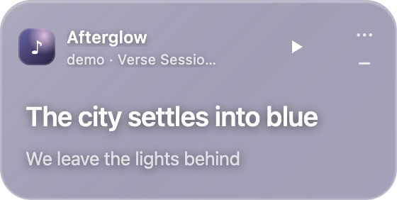
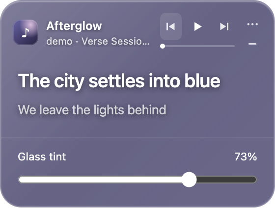

# Verse

A small, always-on-top desktop lyrics companion for Spotify. Built from the original `lyric-beta` Electron / HTML prototype, with its fictional songs and minimal layout preserved. Spotify plays the audio; Verse does not stream or record it.

**Working local beta.** Demo mode, desktop behavior, the real LRCLIB provider, and automated integration checks have been verified on macOS. Spotify authentication and playback are implemented, but **have not been tested with a live Spotify account**. They require your public Client ID and developer access.

## Run

Install **Node.js 22.12 or newer with npm** ([official download](https://nodejs.org/en/download)); Node 24.19.0 was used for verification. In VS Code's terminal, from the repository root:

```sh
npm ci
npm start
```

The first launch offers Spotify setup or a fictional demo. To start directly in demo mode, without loading credentials or making Spotify requests:

```sh
npm run demo
```

`cd lyric-beta && npm start` also works after the root install. Opening `lyric-beta/index.html` directly in a browser provides the original-style visual demo; native window features and Spotify are available only in Electron.

The development machine used for this implementation did not have `node` or `npm` on its normal shell PATH. Verification used a temporary npm CLI and an available Node runtime. Install Node normally and restart the VS Code terminal if your shell says “command not found”; those temporary paths are not required by this repository.

## The overlay

- 280 px wide; height follows wrapped lyrics and the tint control. Unusually long lines scroll within a bounded lyric area so playback controls remain reachable.
- Original white lyrics, small album thumbnail, current and next line, playback controls to the right of the song information. Idle shows play/pause; hovering anywhere on the overlay or using keyboard focus reveals previous/next and the thin seek bar. Reserved space keeps text and window dimensions stable. The play glyph moves within a fixed hit target. Touch devices keep controls visible; reduced motion disables animation.
- Album artwork supplies a dominant color, darkened for white-text readability; colors transition smoothly. Unavailable/black/white artwork gets a neutral violet fallback.
- Drag the header. Its buttons stay clickable. The three-dot button opens **only Glass tint** (0–100%); Escape closes it. Tint changes the glass color, shine and blur, with fully opaque white text. At 0–5%, native vibrancy is disabled for a nearly clear surface; higher values restore native blur.
- Minimize to a **190 × 44 px pill**; click the arrow-free pill to restore. Position, tint, and collapsed state survive restarts. A disconnected display moves the window back into a visible work area.
- Menu-bar equalizer icon: Show/Hide, Connect/Reconnect/Disconnect Spotify, Demo mode, Reset window position, and Quit.
- **Cmd/Ctrl+Shift+L** shows/hides; **Cmd/Ctrl+Q** quits. Closing the overlay hides it; the menu-bar app remains running.
- Demo mode is explicitly labeled in both the expanded window and pill. “Afterglow,” “Tangerine Sky,” and “Low Tide” cycle through the prototype's original sample lyrics. There is no demo audio.

Real Electron captures of the fictional demo (Retina images displayed at logical size):





These are renderer captures, not proof of desktop blur or live Spotify integration. Native material appearance depends on the windows behind Verse and macOS accessibility settings.

## Connect Spotify

1. Open the [Spotify developer dashboard](https://developer.spotify.com/dashboard). Create or select an app with Web API access. The app owner needs an active Spotify Premium subscription.
2. In the app's settings, add this **exact** redirect URI and save:

   ```text
   http://127.0.0.1:43821/callback
   ```

   Use the numeric loopback address, not `localhost`; keep the port and path exactly as shown. Verse binds only `127.0.0.1` while login is pending.
3. Add each tester's Spotify account in the dashboard's **User Management** / allowed-users section. Verify the dashboard actually grants your app and account access.
4. Copy the app's **Client ID** (32 characters). Choose **Connect Spotify…** in Verse's menu-bar menu and enter it in the **Spotify Client ID** field. No client secret is used.
5. Click **Connect in browser**, sign into the intended account, and approve access. The callback tab confirms success. Open Spotify and play a music track on an active device.

Optional development configuration: copy `.env.example` to `.env` at the repository root and enter `SPOTIFY_CLIENT_ID`. A Client ID saved through onboarding takes precedence. Packaged builds use onboarding, not repository `.env` files. **Never put tokens or a client secret in an environment file, source file, or chat.**

Authorization Code with PKCE uses a random verifier and validated OAuth state, opens the system browser, and times out after three minutes. Cancel from onboarding, close onboarding, or choose Cancel Spotify login from the tray menu. Refreshes are coalesced, refresh-token rotation is persisted, and late responses cannot undo a disconnect.

### Current access constraints (checked October 3, 2026)

- Development Mode requires a Premium **app owner** and normally permits **five authorized users**. Existing higher user counts may be grandfathered. Public distribution / extended quota access is a separate Spotify approval process. [Quota modes](https://developer.spotify.com/documentation/web-api/concepts/quota-modes), [February migration guide](https://developer.spotify.com/documentation/web-api/tutorials/february-2026-migration-guide).
- The **July 23, 2026** update increased the developer Client ID limit to **25**, replacing February's one-app limit. Development apps share a per-developer quota. A 429 response can contain `QUOTA_EXCEEDED`; Verse recognizes it and backs off. [July update](https://developer.spotify.com/blog/2026-07-23-web-api-quota-updates).
- Dashboard access and permitted endpoints can vary by app. Existing-app endpoint changes announced for March were postponed; don't assume an old tutorial describes your current access. [Spotify's updated announcement](https://developer.spotify.com/blog/2026-02-06-update-on-developer-access-and-platform-security).
- This app requests only `user-read-playback-state` and `user-modify-playback-state`. It reads `GET /v1/me/player`, and uses `PUT /v1/me/player/play`, `/pause`, and `/seek`, plus `POST /v1/me/player/previous` and `/next`. Remote controls require Premium and a controllable active device; API access, device restrictions, and Spotify's `actions.disallows` may disable them. No Web Playback SDK, private endpoints, cookies, account profile, or client secret are needed. [Playback state](https://developer.spotify.com/documentation/web-api/reference/get-information-about-the-users-current-playback), [play](https://developer.spotify.com/documentation/web-api/reference/start-a-users-playback), [pause](https://developer.spotify.com/documentation/web-api/reference/pause-a-users-playback), [seek](https://developer.spotify.com/documentation/web-api/reference/seek-to-position-in-currently-playing-track).

A successful login does not guarantee access to every player endpoint. A 403 displays an access explanation; Verse never tries to bypass the account's restrictions.

## Lyrics, timing, and requests

[LRCLIB](https://lrclib.net/docs) is a separate service. Requests include title, primary artist, album, and duration in seconds. Verse requires the returned metadata to match and duration to be within two seconds; it favors a missing result over lyrics for a different recording. Remasters, alternate album spellings, and joint-artist credits may therefore fail to match.

Timestamped lyrics support repeated timestamps, decimal precision, global offsets, instrumental gaps, duplicate-time translations, and line-level fallback for enhanced LRC word tags. There is no word-by-word karaoke. Instrumental and missing tracks have explicit states. Plain lyrics appear in a scrollable block labeled **Unsynchronized**; Verse does not invent timing.

The playback clock advances locally between Spotify samples, clamps at track end, and resets on authoritative pause/resume/seek/track updates. Spotify's `timestamp` is a last-state-change time, not a sample time, so it is not incorrectly added to progress. Sleep, unlock, reconnect, and showing the window trigger reconciliation. External seeks/track changes can take until the next poll to be noticed.

Player requests are serialized, time out, and normally poll every 5 seconds while playing, 12 seconds paused/unavailable, 10 seconds collapsed, or 30 seconds hidden. Sleep and screen lock stop polling. Authentication, absent playback, denied access, network failure, and rate limits have distinct states. A transient Spotify failure freezes the last confirmed display until reconnection. Controls take effect locally only after API acknowledgment. There is no device transfer or automatic playback startup.

LRCLIB requests identify Verse, run sequentially with a 350 ms gap, and respect provider-wide `Retry-After`, including non-JSON edge errors. A bounded in-memory cache holds up to 128 results for at most an hour (missing results for five minutes), respecting shorter response cache directives. Transient errors are retried without caching them as missing. Changing tracks cancels lyrics/artwork requests and rejects late responses. There is no lyrics database on disk.

## Transparency and macOS behavior

Electron **42.11.10** supports native macOS `vibrancy: 'hud'` and `visualEffectState: 'active'`; Verse uses those on its transparent, frameless window. This uses macOS material behind the app. **CSS `backdrop-filter` alone cannot blur other desktop windows.** CSS provides the tint, contrast layer, reflective edge, and the browser-preview blur.

This is Electron's supported vibrancy, not a claim to reproduce Apple's full Liquid Glass refraction system. A darker translucent surface is used on other platforms or with `VERSE_DISABLE_VIBRANCY=1 npm start`. Reduce Transparency produces a solid readable surface where Chromium exposes that preference; macOS also controls native material accessibility. See [Electron BrowserWindow](https://www.electronjs.org/docs/latest/api/browser-window/) and [transparent-window limitations](https://www.electronjs.org/docs/latest/tutorial/custom-window-styles).

The window requests floating always-on-top status, all workspaces, and visibility over fullscreen apps. macOS controls final ordering: Mission Control, Stage Manager, screen locking, protected/system windows, and exclusive fullscreen modes may suppress or move it. No accessibility permission or private macOS API is used. Native corner shape and translucency can differ by OS version. Multi-monitor hot-plug geometry is tested with fixtures, but physical monitor changes and every Spaces/fullscreen configuration have not been manually verified. Windows/Linux are untested; secure-storage backends and window behavior differ there.

## Security and privacy

The renderer is sandboxed, context-isolated, and has no Node integration or network access. CSP blocks remote scripts and connections; metadata and lyrics are inserted as text. IPC checks the expected window, main frame, URL, operation, and argument bounds. Navigation, new windows, webviews, and permission requests are denied. Browser opening is limited to fixed onboarding links and the current validated Spotify track URL.

Tokens never go to the renderer or logs. They are encrypted with Electron `safeStorage` (backed by macOS Keychain), then atomically stored with owner-only file permissions outside the repository. Verse refuses unavailable secure storage and Linux's plaintext `basic_text` fallback. [Electron safeStorage](https://www.electronjs.org/docs/latest/api/safe-storage).

On macOS, settings are normally under `~/Library/Application Support/Verse/`: `preferences.json` contains the public Client ID/window settings; `spotify-tokens.enc` contains encrypted credentials. Disconnect deletes tokens, clears in-memory lyrics and playback data, and stops requests. Spotify authorization can also be revoked from your Spotify account's Apps page. No telemetry or listening history is collected. Onboarding's **Privacy & data** explains the metadata sent to LRCLIB and the separate artwork requests.

### Platform policies and distribution

This beta is **not approved by Spotify**. Spotify's [Developer Policy](https://developer.spotify.com/policy) restricts synchronization with visual media, integration with third-party content, and replication of core experiences. Those restrictions are material to a synchronized lyrics companion; separate lyrics rights also need review. A working API response or LRCLIB's open API does not establish permission to distribute this app. Obtain an appropriate determination/permissions before distributing or monetizing it. This repository makes no claim of legal or platform-policy clearance.

The real-playback view attributes Spotify and links back to the current track; lyrics are separately attributed to LRCLIB. Demo content is original fictional material from this repository. Nothing was published, pushed, or registered with Spotify as part of implementation.

## Checks and local build

```sh
npm run check       # syntax
npm test            # core, storage, auth, API, synchronization and stale-request checks
npm run test:ui     # launches real Electron; no account needed
node scripts/check-provider.cjs  # optional live LRCLIB check using its documented example
npm run build:mac   # local unsigned .app for the host CPU architecture
```

The UI test launches isolated temporary profiles, exercises actual rendered layouts and native window sizing, and writes captures to ignored `test-results/`. Spotify-state tests use **fictional fixtures**. Tests that bind the callback listener need permission to listen on loopback. No test performs a real Spotify login or controls a real player.

The macOS build appears at `dist/Verse-darwin-arm64/Verse.app` on Apple Silicon (or `dist/Verse-darwin-x64/Verse.app` on Intel). Open it locally with Finder. The archive includes only the app's HTML, CSS, JS, tray assets and package metadata; environment files, credentials, tests, and dependencies used only for development are excluded. Builds are ignored by Git. There is no signing, notarization, auto-updater, installer, or public distribution pipeline yet. Gatekeeper may require normal local-app approval; do not disable system security globally.

### Verified here

macOS **26.6.2**, Apple Silicon; Node **24.19.0**, Electron **42.11.10**:

- Clean `npm ci`, syntax checks, 33 automated tests, and `npm audit` with **zero reported vulnerabilities**.
- Real Electron rendering: demo play/pause, tint-only settings, 190 × 44 pill, saved tint/collapse, wrapped lyrics, scrolling plain lyrics, instrumental/missing lyrics, disabled controls during network errors, disconnected state, show/hide, onboarding, IPC rejection, and sandbox settings.
- Live LRCLIB exact-match lookup returned synchronized lyrics for its public example. This verifies LRCLIB access, not Spotify access.
- Local macOS `.app` packaging and standalone launch succeeded. The packaged demo was also inspected on the native desktop.

Not yet verified: live Spotify login/refresh/playback/seek, accuracy against actual audio, account/endpoint eligibility, physical display changes, and all macOS fullscreen configurations. Unit tests simulate refresh, denied controls, timing corrections, and stale responses. No demo result is evidence of a working Spotify account connection.

## Troubleshooting

| Symptom | What to do |
| --- | --- |
| `node` / `npm` not found | Install Node 22.12+ including npm; reopen VS Code's terminal. |
| Invalid redirect / login rejected | Register `http://127.0.0.1:43821/callback` exactly, check Client ID and app access, then reconnect. |
| Callback port busy | Quit another Verse instance or the program using port 43821, then reconnect. |
| Login browser closed | Use Cancel login or wait three minutes. Demo remains available. |
| 403 / controls unavailable | Check app owner's Premium, your Premium for controls, allowed users, scopes, and active-device restrictions. Start the song in Spotify. |
| No active playback | Open Spotify and play a track. Ads, podcasts, local files, private/unreported sessions, and missing items may not provide usable track data. |
| Rate limit / developer quota | Let Verse wait; don't repeatedly reconnect. Quota is shared across your developer apps. |
| Wrong/missing lyrics | LRCLIB may lack this exact recording. Plain lyrics are intentionally unsynchronized; no private Spotify lyrics endpoint is used. |
| Window disappeared | Use the tray, Cmd/Ctrl+Shift+L, or tray → Reset window position. If the shortcut is already taken, use the tray. |
| Opaque or inconsistent glass | Check macOS Reduce Transparency; native vibrancy varies by OS. Try the fallback environment flag above. |
| Saved login cannot unlock | Unlock your Keychain. If necessary choose Disconnect, then Connect again. No plaintext token fallback is used. |
| Reset everything | Quit Verse, then remove its application support folder yourself. This also removes the encrypted login. |

Code remains in `lyric-beta`: `main.cjs` manages windows/tray/IPC; `preload.cjs` is the narrow bridge; `src/auth.cjs`, `spotify.cjs`, `playback.cjs`, `lyrics.cjs`, `artwork.cjs`, and `storage.cjs` isolate services; `core.js` contains shared timing/LRC/color/geometry functions; `renderer.js` and the original `demo.js` drive the plain HTML interface.

UI reference update verified October 5, 2026: idle/hover/keyboard geometry, clicks during icon motion, touch emulation, reduced motion, saved 0% and 100% tint, and the arrow-free pill were checked in real Electron. Spotify skip actions are covered by API fixtures; no live account playback was changed during these UI checks.
